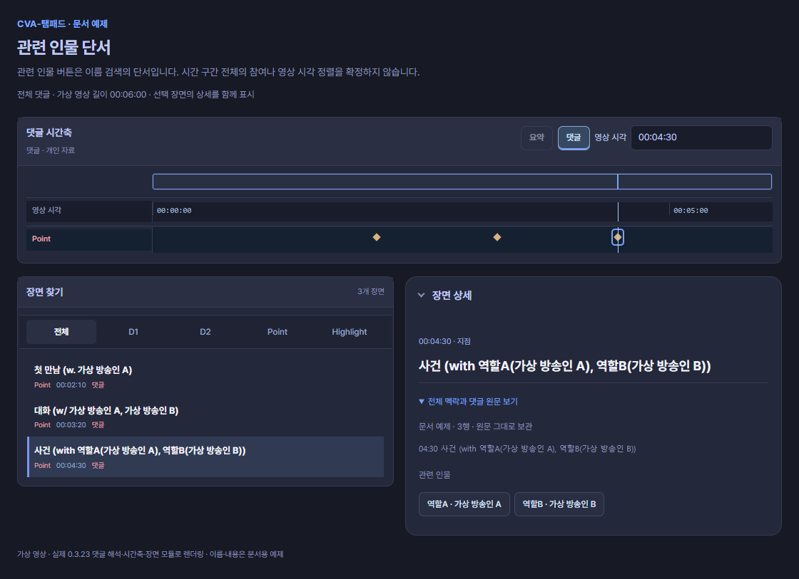
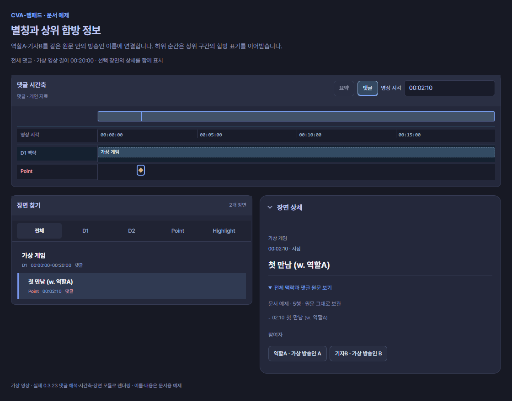

# 인물과 합방

댓글에 이름을 적으면 호환 도구가 방송인을 찾을 수 있습니다. 이름 표기, 참여 구간, 실제 채널, 영상 시각은 각각 다른 정보입니다. 문서 초안 0.4의 소비자 후보는 아래 형식을 읽으며, 기존 댓글을 새 형식으로 다시 작성할 필요는 없습니다.


> 아래 그림은 문서의 가상 댓글을 현재 0.3.23 모듈로 렌더링한 로컬 시안입니다. 실제 방송 분석이나 승인된 컷이 아닙니다. 그림의 영상 길이·전체 또는 부분 본문 조건에 따라 자동 끝이 달라집니다. [시간축 읽는 법](timeline.md)에서 각 행의 의미를 확인하세요.

## 관련 인물 단서

```text
02:10 첫 만남 (w. 가상 방송인 A)
03:20 대화 (w/ 가상 방송인 A, 가상 방송인 B)
04:30 사건 (with 역할A(가상 방송인 A), 역할B(가상 방송인 B))
```



**화면에서 읽기:** 세 시각은 각각 Point입니다. 인물 이름은 **참가자 후보**로 남고, 역할A·역할B와 실제 이름의 대응을 함께 확인할 수 있습니다. 이것만으로 합방 구간 막대·영상 연결·시각 정렬을 만들지는 않습니다.

`w.`, `w/`, `with`는 대소문자를 구분하지 않습니다. 닫힌 괄호 뒤의 설명도 원문에 남깁니다. 명시 with 괄호를 우선하며, with가 없는 마지막 명단 괄호는 두 명 이상일 때 검색 단서로 읽습니다. 쉼표는 가장 바깥 수준에서만 이름을 나눕니다. `역할A(가상 방송인 A)`는 역할A를 화면 표기로, 가상 방송인 A를 검색어로 사용합니다. 여러 이름이 들어 있는 내부 괄호는 한 사람의 가명으로 확정하지 않습니다.

이 표기는 **관련 인물 후보**입니다. 도구가 장면 안에서 이름을 보여줄 수 있지만 그 사람이 구간 전체에 참여했다는 뜻은 아닙니다. `합방:`, `함께:`, `참여:`로 명시한 참여자 목록과 구별합니다. 명시 목록은 기존 제목 부모 상속 규칙을 따릅니다.

## 한 원문 안에서 가명을 연결하기

```text
별칭: 역할A = 가상 방송인 A
별칭: 기자B = 가상 방송인 B
# 00:00 ~ 20:00 가상 게임
합방: 역할A, 기자B
- 02:10 첫 만남 (w. 역할A)
```



**화면에서 읽기:** D1의 명시 합방 명단은 가상 방송인 A·B로 연결되고, 하위 Point에도 **같은 명단이 이어집니다**. 상세의 부모 맥락과 참여자 이름을 함께 확인하세요. Point의 `w. 역할A`는 가상 방송인 A라는 후보 단서입니다. 부모의 명시 명단 상속과 Point의 후보 이름은 서로 다른 정보입니다.

`별칭:` 행은 시간을 만들지 않습니다. 별칭은 같은 원문 문서에만 적용합니다. 같은 작성자의 답글을 이어 읽어도 다른 답글에서 선언한 별칭으로 앞 원문의 이름을 바꾸지 않습니다. 부모의 명시 명단을 상속할 때에는 **명단을 선언한 원문**의 별칭을 사용합니다.

같은 원문에서 한 별칭이 서로 다른 방송인에게 연결되면 충돌입니다. 첫 번째 이름을 선택하거나 자동 조회하지 않습니다. 원문을 보존하고 작성자 또는 사용자가 연결을 수정해야 합니다. 같은 시각·같은 이름의 원문 행도 삭제하지 않습니다.

구조 파일은 문서별 `aliases: [{"alias":"역할A","streamer":"가상 방송인 A"}]`로 같은 의미를 표현할 수 있습니다. [가져오기 형식](files.md)을 참조하세요.

## 소비자가 확인해야 할 경계

댓글을 고치지 않고 참가자나 역할 연결을 지정하려면 [한 줄 입력과 참가자 파일](files.md#참가자와-역할-이름-가져오기)을 사용합니다. 댓글의 관련 인물 후보와 사용자가 지정한 참가자 자료는 원문과 출처를 구분하여 유지합니다.

이름 일치만으로 채널 신원을 보장하지 않습니다. 현재 소비자는 유일하게 정확한 이름이 일치하는 검색 결과만 자동 후보로 사용하고, 모호하면 채널 선택을 요청합니다. 방송 시작 시각과 길이로 현재 방송 시각을 포함하는 다시보기를 찾습니다. 재시작으로 여러 다시보기가 생겼으면 현재 시각을 포함하는 파일을 선택하며 공백은 매칭 실패로 남깁니다. 사용자는 다른 다시보기를 고를 수 있어야 합니다.

방송 시각 일치는 같은 사건의 장면·영상 0초·실제 음성 싱크를 확인한 결과가 아닙니다. 실제 장면의 개인 보정은 소비자 편집 기능에서 처리합니다. URL, channel ID, 전역 인물 사전, 플랫폼 간 인물 연결, 자동 게시 및 자유문장에서의 무차별 인물 추출은 이 형식의 보장 범위가 아닙니다.

## 명시 합방 명단

`합방: 가상A, 가상B`는 직전 제목 또는 끝이 있는 합방 범위에 붙는 명시 명단입니다. 자식은 가장 가까운 부모의 명단을 이어받고, 새 독립 주제나 목록은 앞 명단을 이어받지 않습니다. `없음`은 명시적으로 참여자가 없다는 뜻, `미확인`은 모른다는 뜻이며 누락과 구별합니다. 중복·충돌은 확인 안내를 남깁니다.
