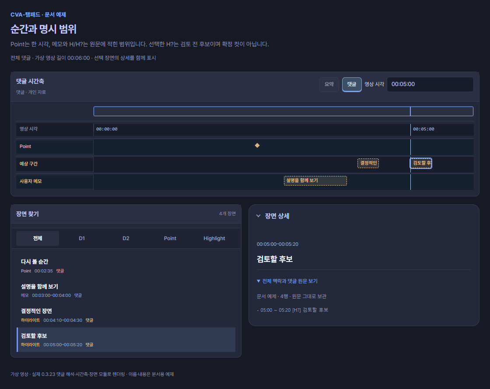
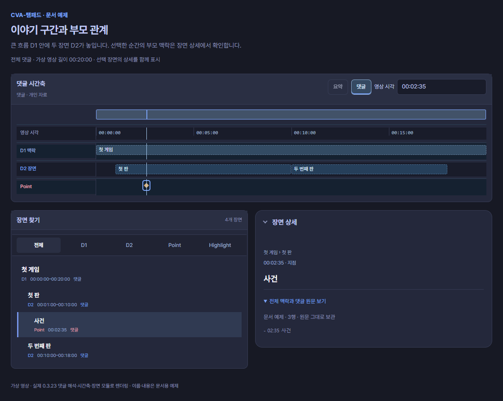
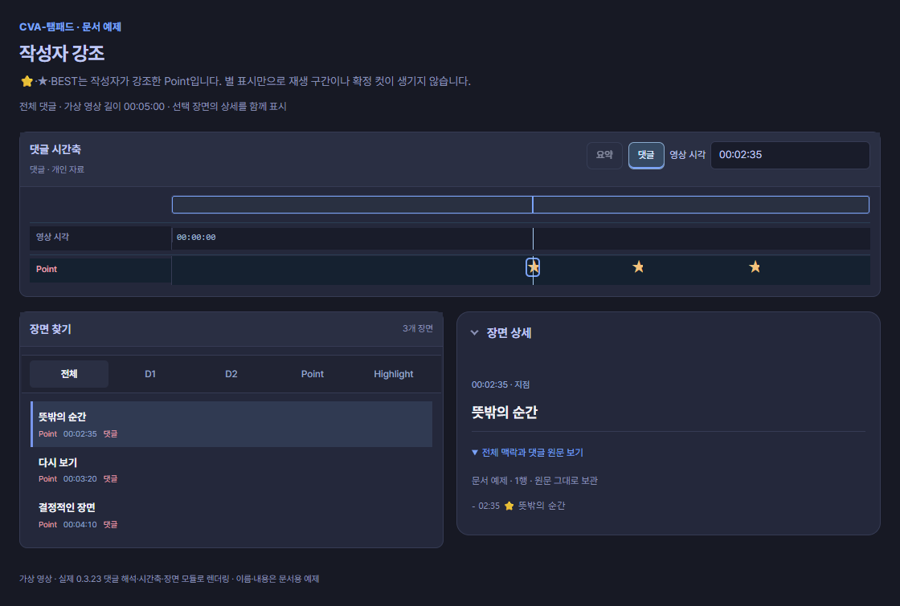
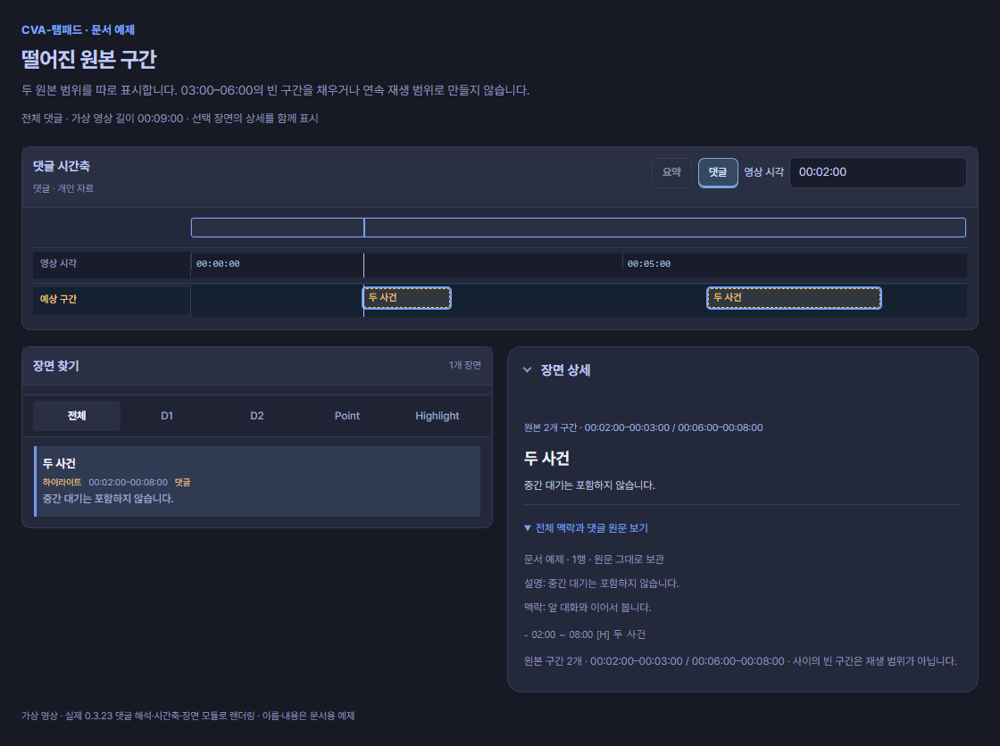

# 구간과 강조

순간은 **한 지점**, 구간은 **시작부터 끝까지**입니다. 여러 순간이 나란히 있다는 이유만으로 사이를 재생 범위로 채우지 않습니다.


> 아래 그림은 문서의 가상 댓글을 현재 0.3.23 모듈로 렌더링한 로컬 시안입니다. 실제 방송 분석이나 승인된 컷이 아닙니다. 그림의 영상 길이·전체 또는 부분 본문 조건에 따라 자동 끝이 달라집니다. [시간축 읽는 법](timeline.md)에서 각 행의 의미를 확인하세요.

## 순간과 명시 범위

```text
- 02:35 다시 볼 순간
- 03:00 ~ 04:00 [메모] 설명을 함께 보기
- 04:10 ~ 04:30 [H] 결정적인 장면
- 05:00 ~ 05:20 [H?] 검토할 후보
```



**화면에서 읽기:** 02:35는 Point 하나입니다. 03:00–04:00은 사용자 메모, 04:10–04:30과 05:00–05:20은 예상 구간 행의 범위입니다. `[H?]`는 검토 전 후보이며, 현재 행의 모양은 `[H]`와 같습니다. 선택한 항목의 **전체 맥락과 댓글 원문 보기**에서 `[H?]` 표기를 확인하세요. `[H]`도 승인된 컷을 뜻하지 않습니다.

구간은 `[시작, 끝)`입니다. 끝은 시작보다 뒤여야 합니다. `[H?]`는 후보이지 승인된 컷이 아닙니다. `[P]` 순간에 끝을 붙이면 진단 대상입니다. 역할 없는 기존 범위는 호환 경로에서 메모로 보존할 수 있지만 새 작성에는 역할을 명시하세요.

## 이야기 구간과 자동 끝

```text
# 00:00 ~ 20:00 첫 게임
## 01:00 ~ 10:00 첫 판
- 02:35 사건
## 10:00 ~ 18:00 두 번째 판
```



**화면에서 읽기:** D1은 00:00–20:00의 큰 흐름입니다. D2는 01:00–10:00과 10:00–18:00의 두 장면이고, 02:35 사건은 첫 판 안의 Point입니다. 이 예제의 끝은 원문에 명시되어 있습니다. 시작만 적은 경우는 [자동 끝 비교](timeline.md#자동-끝과-예상-구간은-다릅니다)에서 확인하세요.

제목 `#`부터 `######`까지 깊이 1–6을 읽습니다. 바로 위 단계 부모가 있어야 합니다. 단계가 누락되면 부모 구간을 만들어 채우지 않습니다.

제목에 시작만 있으면 다음 같은 단계·상위 제목, 부모 끝, 확인된 영상 끝을 경계로 사용할 수 있습니다. **부분 본문·누락 경계·알 수 없는 길이에서는 끝이 미확정**일 수 있습니다. 명시한 끝은 자동 계산으로 덮어쓰지 않습니다. 하위 구간이 부모 밖으로 나가거나 명시 구간이 겹치면 확인 안내를 남깁니다.

## 작성자 강조

```text
- 02:35 ⭐ 뜻밖의 순간
- 03:20 ★ 다시 보기
- 04:10 BEST 결정적인 장면
```



**화면에서 읽기:** 세 항목 모두 길이 없는 Point입니다. `⭐`, `★`, 독립된 `BEST`는 같은 작성자 강조 상태로 읽어 별 표식으로 표시합니다. 별 사이를 구간으로 채우지 않습니다.

별표와 독립된 `BEST`는 작성자 강조입니다. 재미 점수·편집 승인·구간 역할과는 별개입니다. `BESTiary` 같은 단어는 강조가 아닙니다. 플랫폼 배지와 좋아요도 작성자의 문자 강조로 바꾸지 않습니다.

## 설명과 떨어진 원본 구간

```text
- 02:00 ~ 08:00 [H] 두 사건
설명: 중간 대기는 포함하지 않습니다.
맥락: 앞 대화와 이어서 봅니다.
원본 구간: 02:00 ~ 03:00; 06:00 ~ 08:00
```



**화면에서 읽기:** 같은 항목이 **02:00–03:00**, **06:00–08:00**의 두 막대로 표시됩니다. 가운데 03:00–06:00은 비어 있습니다. 항목의 바깥 범위와 실제 원본 구간을 구별하고, 설명·맥락도 함께 확인합니다.

설명은 직전 항목에 붙습니다. 떨어진 원본 구간은 정렬되고 겹치지 않으며 바깥 범위 안에 있어야 합니다. 03:00–06:00의 빈 부분을 재생 범위로 채우지 않습니다. 세부 원본 구간에만 최대 밀리초 세 자리까지 읽습니다. `검토 상태:`에 적힌 문장이 도구의 승인 권한을 주지는 않습니다.

## 긴 댓글 나누기

분할 기능은 항목·부모 맥락·명단을 보존하고 자동 끝을 명시한 뒤 나눕니다. 진단이나 미확정 끝이 있거나 한 항목 자체가 한도를 넘으면 실패를 알립니다. 의미를 잘라낸 결과를 성공으로 표시하지 않습니다. 함수 기본 5,000자는 플랫폼의 공식 댓글 한도를 뜻하지 않습니다.
